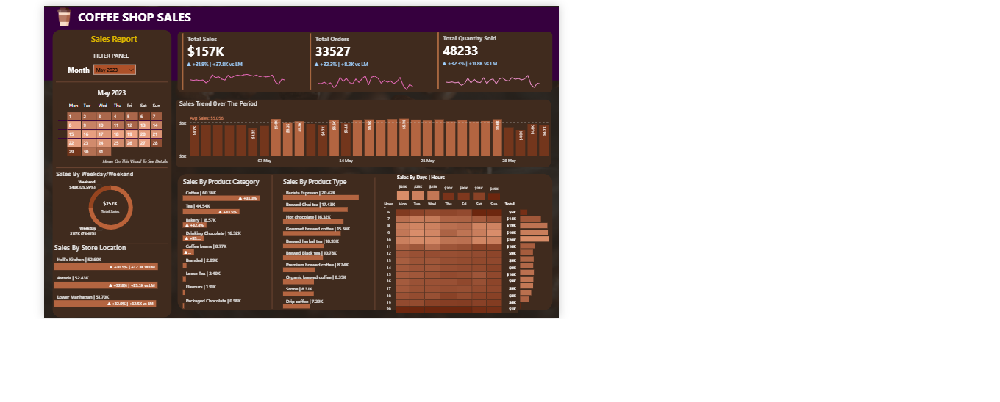

# ☕ Coffee Shop Sales Dashboard


## 📌 Project Overview

The **Coffee Shop Sales Dashboard** is an interactive Business Intelligence solution developed using **Microsoft Power BI** to analyze coffee shop sales data and provide meaningful business insights.

The dashboard transforms raw transactional data into a visually rich report that helps business owners and analysts monitor sales performance, identify top-selling products, compare store performance, and understand customer purchasing behavior across different dates and time periods.

The report makes extensive use of **Power Query**, **DAX**, **Data Modeling**, **Custom Tooltips**, and **Interactive Visualizations** to enable efficient decision-making.

---

# 🎯 Business Objective

The primary objectives of this dashboard are to:

- Monitor overall sales performance
- Track customer orders and quantities sold
- Compare sales across different store locations
- Analyze sales trends over time
- Identify best-performing product categories
- Understand hourly and daily customer traffic
- Compare weekday and weekend sales
- Build an interactive dashboard for business users

---

# 📊 Dashboard Preview

### Main Dashboard

> *(Replace with your dashboard screenshot)*

## Dashboard



The dashboard presents all major KPIs together with sales trends, store analysis, product analysis, calendar filtering, and heatmaps on a single page.

---

# 🛠 Technology Stack

| Tool | Purpose |
|------|----------|
| Microsoft Power BI | Dashboard Development |
| Power Query | Data Cleaning & Transformation |
| DAX | Calculated Measures |
| Data Modeling | Relationship Building |
| Excel / CSV | Data Source |

---

# 📂 Dataset Information

| Attribute | Description |
|------------|-------------|
| Dataset | Coffee Shop Sales |
| Data Type | Transactional Sales Data |
| Industry | Retail / Food & Beverage |
| Analysis Type | Sales Analytics |
| Time Analysis | Daily, Monthly, Hourly |

The dataset contains information about:

- Transaction ID
- Transaction Date
- Transaction Time
- Product Category
- Product Type
- Product Details
- Unit Price
- Quantity Sold
- Store Location
- Sales Amount

---

# 📈 Key Performance Indicators (KPIs)

The dashboard monitors the following KPIs:

- 💰 Total Sales
- 🛒 Total Orders
- ☕ Total Quantity Sold
- 📅 Month-over-Month Sales Comparison
- 📊 Average Daily Sales
- 📈 Sales Growth Indicators

These KPIs provide an instant overview of business performance.

---

# 📉 Dashboard Features

### ✔ Executive KPI Cards

Displays

- Total Sales
- Total Orders
- Total Quantity Sold

---

### ✔ Monthly Sales Trend

Shows sales variation across the selected month, allowing users to identify peak-performing days.

---

### ✔ Product Category Analysis

Analyzes revenue generated from categories such as:

- Coffee
- Tea
- Bakery
- Drinking Chocolate
- Coffee Beans
- Flavours
- Packaged Chocolate

---

### ✔ Product Type Analysis

Provides detailed sales by product types including:

- Brewed Coffee
- Barista Espresso
- Gourmet Coffee
- Organic Coffee
- Premium Coffee
- Hot Chocolate
- Tea

---

### ✔ Store Performance

Compare sales generated by multiple store locations to identify high-performing branches.

---

### ✔ Weekday vs Weekend Analysis

Evaluates customer purchasing behavior during weekdays and weekends.

---

### ✔ Day & Hour Heatmap

One of the most useful visuals in the dashboard.

The heatmap identifies:

- Peak business hours
- Busy weekdays
- Customer purchasing patterns
- High-performing sales periods

---

### ✔ Calendar Filter

An interactive calendar enables users to filter dashboard visuals based on selected dates.

---

### ✔ Dynamic Tooltips

The report contains custom tooltip pages for additional insights.

#### Calendar Tooltip

Displays

- Total Sales
- Orders
- Quantity Sold
- Date-wise Performance
- Sales Distribution

#### Day & Hour Tooltip

Displays

- Day
- Hour
- Sales
- Orders
- Quantity
- Previous Month Comparison

---

# 📊 Visualizations Used

The report includes:

- KPI Cards
- Clustered Bar Charts
- Column Charts
- Donut Charts
- Heatmap
- Calendar Visual
- Matrix
- Slicers
- Custom Tooltips
- Dynamic Cards

---

# 🧹 Data Cleaning (Power Query)

The dataset was prepared using Power Query by performing:

- Data type validation
- Date formatting
- Time formatting
- Removal of unnecessary columns
- Data transformation
- Data quality checks
- Loading transformed data into the model

---

# 🧠 DAX Measures

Several DAX measures were created to calculate dashboard metrics.

Examples include:

- Total Sales
- Total Orders
- Total Quantity
- Current Month Sales
- Previous Month Sales
- Sales Difference
- Sales Growth %
- Average Daily Sales

These measures enable dynamic calculations and interactive filtering.

---

# 🗂 Data Model

The report follows a simple and efficient **Star Schema**.

### Tables

### Transactions (Fact Table)

Contains

- Sales
- Quantity
- Orders
- Product Details
- Store Information
- Transaction Date
- Transaction Time

### Date Table (Dimension Table)

Contains

- Date
- Day Name
- Day Number
- Month
- Month Number

Relationship

```
Date Table (1)
      │
      │
Transactions (*)
```

This model improves report performance and simplifies DAX calculations.

---

# 🎛 Interactive Features

The dashboard includes

- Calendar Filter
- Cross-filtering
- Dynamic Tooltips
- Hover Effects
- Interactive Charts
- Responsive Visual Interactions

---

# 💼 Business Questions Answered

The dashboard helps answer questions such as:

- Which store generates the highest revenue?
- Which products contribute the most sales?
- Which product categories perform best?
- Which days generate maximum revenue?
- What are the busiest hours?
- How do weekends compare with weekdays?
- How do sales change over time?
- Which products need improvement?

---

# 💡 Business Insights

Using this dashboard, stakeholders can:

✔ Monitor business performance in real time

✔ Compare store-wise sales

✔ Identify top-selling products

✔ Understand customer buying patterns

✔ Optimize staffing based on busy hours

✔ Improve inventory planning

✔ Increase operational efficiency

✔ Make data-driven business decisions

---

# 📁 Repository Structure

```
Coffee-Shop-Sales-Dashboard
│
├── Dashboard.pbix
├── Coffee Shop Sales.xlsx
├── README.md
│
├── Images
│   ├── Dashboard.png
│   ├── Calendar Tooltip.png
│   ├── Day Hour Tooltip.png
│   └── Data Model.png
│
└── Documentation
```

---

# 📸 Screenshots

## Dashboard


---

## Calendar Tooltip


---

## Day & Hour Tooltip


---

## Data Model


---

# 🚀 Future Improvements

Potential enhancements include:

- Customer Segmentation
- Profit Analysis
- Forecasting
- Drill-through Pages
- Mobile Dashboard
- Inventory Analytics
- Employee Performance Dashboard
- AI-powered Insights

---

# 🎓 Skills Demonstrated

This project demonstrates proficiency in:

- Power BI Dashboard Development
- Power Query
- Data Cleaning
- Data Modeling
- Star Schema Design
- DAX Calculations
- Data Visualization
- Business Intelligence
- Dashboard Design
- Analytical Thinking

---

# 📚 Key Learnings

Through this project, I gained practical experience in:

- Designing professional dashboards
- Building interactive reports
- Creating reusable DAX measures
- Implementing custom tooltips
- Building efficient data models
- Transforming raw data into business insights
- Improving dashboard usability and performance

---

# 👨‍💻 Author

**Saanvi**

Second-Year Engineering Student

Aspiring Data Analyst | Power BI Enthusiast | Business Intelligence Learner

---

## ⭐ If you found this project helpful

If you like this project, consider giving it a **Star ⭐** on GitHub.

It motivates me to build and share more data analytics projects.
